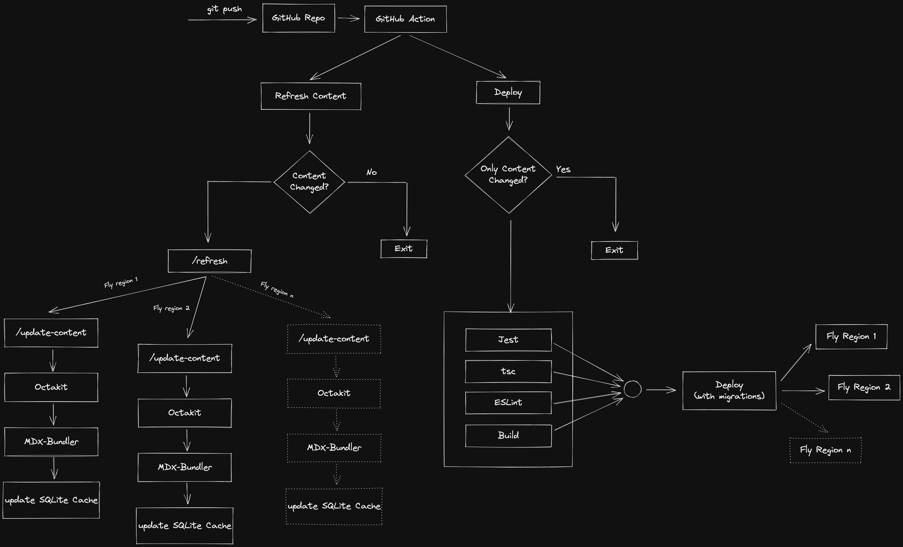

# Remix Speed Metal Stack

Learn more about [Remix Stacks](https://remix.run/stacks).

```sh
npx create-remix --template Girish21/speed-metal-stack
```

## Remix Blog 📖

This blog starter template was inspired heavily by Kent C. Dodds implementation of [kentcdodds.com][kcd]. You can read more about the architecture and the idea behind it at [How I built a modern website in 2021][kcd-arch].

## Architecture 💡



## Important 🚧

Fly requires a globally unique name for all the apps, and we've used the directory name and random hash as the app name. Of course, you can change this anytime you want BEFORE launching the app with Fly CLI. But it's not a big deal since you can reassign the internal Fly URL to any custom domain by adding a [`CNAME`][cname] record to your custom domain pointing to the Fly internal URL. We'll see that later when deploying the app to production.

## Quickstart

```sh
# run database migrations and set up the initial blog
npm run setup
# run the initial build for the development server
npm run build
# start the development server and run other processes in parallel in watch mode
npm run dev
```

## Available scripts

- `build` - compile and build the express server, Remix app, Tailwind in `production` mode
- `dev` - starts the express server, Remix watcher, Tawilwind CLI in watch mode
- `format` - runs prettier on the codebase and fixes fixable issues
- `lint` - runs ESLint on the codebase
- `new:blog` - create a new Blog post template from the command line
- `start` - starts the express server (should only be executed after running `npm run build`)
- `test` - runs `vitest`
- `test:e2e:dev` - starts the cypress runner in development mode
- `test:e2e:run` - starts the cypress runner in CI mode
- `typecheck` - runs type check on the codebase

## Fly Setup 🛠

1. [Install Fly](https://fly.io/docs/getting-started/installing-flyctl/)

2. Sign up and log in to Fly

   ```sh
   flyctl auth signup
   ```

## Database 🗃

We use [SQLite][sqlite] as the database in this template. SQLite is a fast database engine, a great option to persist data without reaching for advanced database engines like Postgres.

### Installation ⚙️

SQLite comes pre-installed on all Macs. You can check the official installation guides for other OS's [SQLite Installation Guides][sqlite-installation]

### Why do we need a database ❓

We use [MDX-Bundler][mdx-bundler] to compile the MDX files, and MDX-Bundler uses `esbuild` internally to compile the MDX files. Though `esbuild` is very fast, there is a noticeable lag during this process which is not suitable for the performance of the site and the user experience. And since there is no need to compile MDX on every request when the data does not change seems like a waste of time and performance. So instead, we can cache the compiled MDX and recompile it only when we know the content has changed.

### Prisma △

We use [Prisma][prisma] as the ORM in this template. To create the SQLite database and initialise the database schema, run:

```sh
npx prisma migrate dev
```

The above command will prompt for a migration name, and you can name it as `initial migration`. This command will also install Prisma Client for interacting with the database.

## Development 💻

We can start our development server with the migrations run and the SQLite database populated with the initial schema. Then, from a new tab in your terminal, run the command.

```sh
npm run dev
```

This command starts four processes concurrently.

- The Remix dev server starts in development mode and rebuilds assets on file change.
- Tailwind CLI which rebuilds the stylesheet when the styles change
- An [MSW][msw] server which intercepts the API calls to GitHub and serves the content from the local instead of calling the remote API
- A file watcher watches over the `content` directory and rebuilds the assets.

### Relavant files 🔍

- Tailwind config [tailwind.config.js](./tailwind.config.js)
- MSW API mock server [mock](./mocks/start.ts)
- Content change watcher [refresh-on-content-change](./others/refresh-on-content-change.ts)

## Deployment 🚀

### Initial setup 👀

Before proceeding to deploy our app, we have some steps to take care of:

- Create a GitHub account [GitHub](https://repo.new)
- Create a new app on Fly

```sh
flyctl launch --name YOUR_APP_NAME --copy-config --no-deploy
```

> ⚠️ Remember not to deploy since we have some setup steps left to complete!

### Environment variables and Secrets 🤫

This template comes with GitHub actions workflows to automatically deploy the app to Fly.io. First, we need to set up our GitHub actions and the Fly app with some secrets. Let's do that now.

To push the build image to the remote Fly registry from GitHub action, we need an access token from Fly. We can generate that using the Fly command line, run:

```sh
flyctl auth token
```

The command will generate an access token. You can then add this token to your GitHub actions secrets by visiting your GitHub repository's `settings` page `https://github.com/:owner/:repo/settings/secrets/actions` and then click `New repository secret`. Next, GitHub will prompt for a key and a value. The key should be `FLY_API_TOKEN`, and the value will be the token generated by the command line.

We also need to set the Fly app name as a secret, the key should be `FLY_APP_NAME`, and the value will be the app name specified in [fly.toml](./fly.toml)

Now we need to set up secrets in our Fly app.

Since we're fetching the content from GitHub on demand instead of building all the pages upfront, we need an access token from GitHub to call the GitHub API and fetch the content. Also, GitHub won't rate-limit the app from calling the GitHub API more often. So, you can generate an access token at [Personal access token](https://github.com/settings/tokens). Then, you can copy the generated token and set it to your app's secret. We can do that by running the following command:

```sh
flyctl secrets set GITHUB_TOKEN={GITHUB_TOKEN}
```

We also need a secret to sign our session. We can do that by running the command:

```sh
flyctl secrets set SESSION_SECRETS=$(openssl rand -hex 32)
```

> If `openssl` is not available, you can generate a secure token using a password generating service like [`1Password`][generate-password].

The last secret required is a token for securely communicating between the GitHub action and our app deployed on a remote server since we need a public-facing API for this communication.

```sh
openssl rand -hex 32
```

We have to set this secret as part of the GitHub actions secret and a Fly secret. The key should be `REFRESH_TOKEN`. You can create a new actions secret in GitHub and create a new secret for the Fly app by running the command.

```sh
flyctl secrets set REFRESH_TOKEN={GENERATED_PASSWORD}
```

### Volumes 💾

We also need to create a volume in Fly to persist our app data (SQLite DB) so that Fly can persist the data stored across deployments and container restarts. Again, we can do that using the Fly command line.

```sh
flyctl volumes create data --region [REGION] --size 1
```

> Note: REGION should be the region selected when launching the app. You can check the region chosen by running `flyctl regions list`.

It's important to note that Volumes are bound to an app in a region and cannot be shared between apps in the same region or across multiple regions.

You can learn more about Fly Volumes [here][volumes]

### Push to Prod 🥳

We are ready for our first deployment. GitHub actions workflows are configured to run on push to the `main` branch. So let's push the local branch `main` to remote, triggering the workflows.

Once all the checks are passed, and the deployment is complete, you can run:

```sh
flyctl info
```

To get the current app URL and IP address. The app URL will be `https://YOUR_APP_NAME.fly.dev`. You can visit that URL, and the site should be online. That's it. You have deployed your blog built using REMIX!.

### Adding Custom Domain 🔖

To add a custom domain to the app, you first must buy a domain from a Domain Name Register, and you can choose one of your preferences. Some popular options are [Domain.com](https://www.domain.com/), [Google](https://domains.google.com/registrar), [Cloudflare](https://www.cloudflare.com/en-gb/products/registrar/).

After buying the domain, we can add a DNS record to point to the domain or create a subdomain and point that to the Fly app URL. We can do that by adding a DNS record using the CNAME option and entering the Fly URL `https://YOUR_APP_NAME.fly.dev`.

We also have to create an SSL certificate on Fly with the domain name. We can do that by running the command:

```sh
flyctl certs create [DOMAIN]
```

You can read more about this at [SSL for Custom Domains](https://fly.io/docs/app-guides/custom-domains-with-fly/)

That's it, and we are ready to share our blog with the rest of the world! But there is one more step to take care of before sharing it.

### Scaling ⚖️

There are two ways of scaling an application, vertical and horizontal.

In vertical scaling, the system is scaled by adding more compute resources to the server (increasing the CPU/RAM). Fly supports vertical scaling, and you can check the docs here [scaling virtual machines](https://fly.io/docs/reference/scaling/#scaling-virtual-machines).

Horizontal scaling is achieved by adding more replicas of the same application, either in the same region or in other regions worldwide. Fly supports many regions worldwide, and you can read more about them here [Fly regions](https://fly.io/docs/reference/scaling/#scaling-virtual-machines).

Our app is currently deployed in only one region we selected when we ran `flyctl launch`. This is fine during prototyping and development, but when pushing for production, we would want our app to be accessible from regions worldwide and have similar performances for users worldwide. In this case, we can add more replicas of our app worldwide, at least in the regions with many targetted users, so that the app will run on the servers closer to the users, and all the users will have comparable performance.

Since Fly [anchors the regions](https://fly.io/docs/reference/volumes/#creating-volumes) based on the volumes created, we can add more regions by creating a volume in the new region or adding a replica in the same region. For example, we can do that by:

```sh
flyctl volumes create data --region [NEW_REGION] --size 1
```

> You can check this list of available regions at [Fly regions][fly-regions]

And then increase the [scale count](https://fly.io/docs/reference/scaling/#count-scaling) of the Fly app by running the command:

```sh
flyctl scale count 2
```

> The above command will set the scale count to 2, meaning two instances of our app will run on the specified regions where the volumes are created.

You can read more about scaling at [Fly scaling][fly-scaling]

## API Mocks 🔸

Our architecture is to fetch the blog content from the GitHub repository on demand and not bundle the content as part of the build. Therefore, we will be making a significant amount of API calls to GitHub. And with any API, there come restrictions such as rate limit, calls per minute, etc. And when we're writing an article, the process becomes tedious since we're making calls to the GitHub API; the article has to be on GitHub so that the API can return the content. This process is not ideal. We can do better.

Instead, we can mock the API request to GitHub and serve the articles locally, providing a better experience. Instead of calling the GitHub API, we use [MSW][msw] to intercept the request and return a mocked response that serves the content from the local file system.

## Linting ⬡

This template comes preconfigured with [ESLint][eslint] and [Prettier][prettier] rules and is integrated with the workflow as a build step. For example, you can run `npm run lint` to run ESLint on the project and `npm run format` to run prettier.

## Styling 💅🏻

This template comes preconfigured with [Tailwindcss][tailwind] with all the scripts required during development and production.

The template also comes with a theme toggler preconfigured and can detect the suitable theme and prevent [FART][fart]

## Testing 🔬

This template comes preconfigured with [Jest][jest] and [React testing library][rtl] for unit testing and [Cypress][cypress] for e2e testing and is configured to run as part of the GitHub actions. You can run the `npm run test` command to run the Jest test suite. And `npm run test:e2e:run` to run the Cypress tests in a headless mode. You can check [package.json](./package.json) for the available commands.

## Type check ʦ

You can run `npm run typecheck` to run `tsc` on the codebase. Type check is also included as part of the deployment workflow.

## Debugging

Some helpful commands to debug the application on Fly using the command line

### Logs

You can check the logs using the command `flyctl logs` from the project directory, containing the `fly.toml` file in the project's root. You can also check the logs from the console by visiting [fly.io/apps](https://fly.io/apps).

### Console

You can also log in to the remote console using the `flyctl ssh console` command.

### Database

After logging in to the console, you can also inspect the SQLite DB. But first, we have to install SQLite on the remote machine. We can do that using the `apt-get install sqlite3` command. Then, `cd` into the volume using the `cd data` command (Note: `data` refers to the volume's name created from the command line). And then run the command `sqlite3 sqlite.db` to open a command-line interface into the database.

## Important links

- [Remix](https://remix.run/)
- [Remix docs](https://remix.run/docs/en/v1)
- [Fly.io](https://fly.io/)
- [flyctl](https://fly.io/docs/flyctl/)
- [Fly secrets](https://fly.io/docs/reference/secrets/)
- [Fly scaling][fly-scaling]
- [Fly volumes](https://fly.io/docs/reference/volumes/)
- [Fly regions][fly-regions]
- [Fly configuration](https://fly.io/docs/reference/configuration/)
- [MDX Bundler][mdx-bundler]
- [SQLite][sqlite]

[kcd]: https://kentcdodds.com/
[kcd-arch]: https://kentcdodds.com/blog/how-i-built-a-modern-website-in-2021
[cname]: https://en.wikipedia.org/wiki/CNAME_record
[sqlite]: https://www.sqlite.org/index.html
[mdx-bundler]: https://github.com/kentcdodds/mdx-bundler
[sqlite-installation]: https://www.sqlite.org/download.html
[prisma]: https://prisma.io
[msw]: https://mswjs.io/
[tailwind]: https://tailwindcss.com/
[fart]: https://css-tricks.com/flash-of-inaccurate-color-theme-fart/
[generate-password]: https://1password.com/password-generator/
[volumes]: https://fly.io/docs/reference/volumes/
[eslint]: https://eslint.org/
[prettier]: https://prettier.io/
[cypress]: https://www.cypress.io/
[jest]: https://jestjs.io/
[rtl]: https://testing-library.com/
[fly-regions]: https://fly.io/docs/reference/regions/
[fly-scaling]: https://fly.io/docs/reference/scaling/
